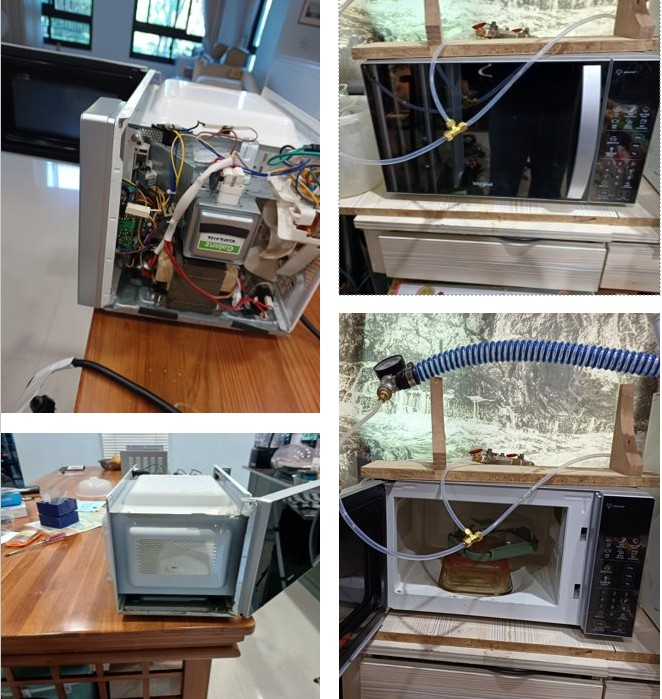
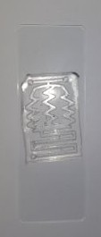
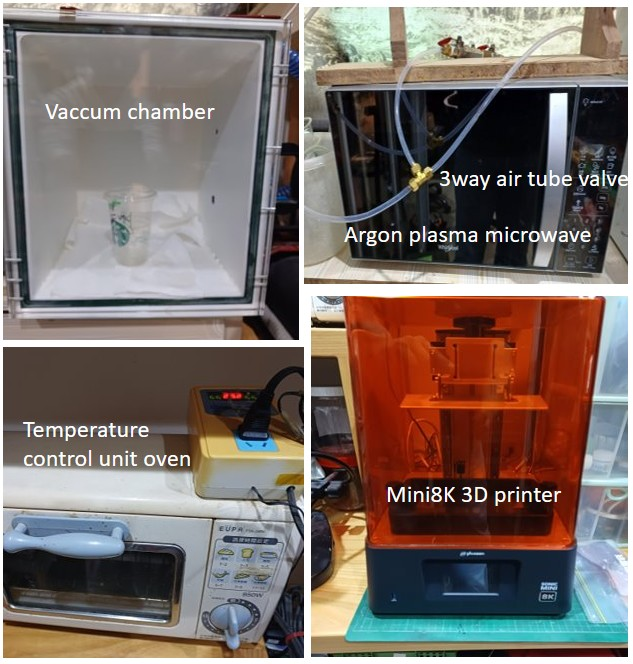
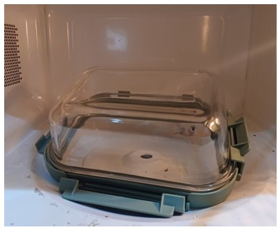
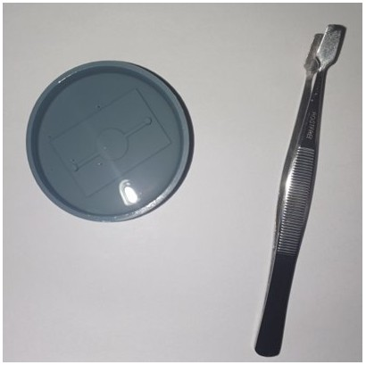
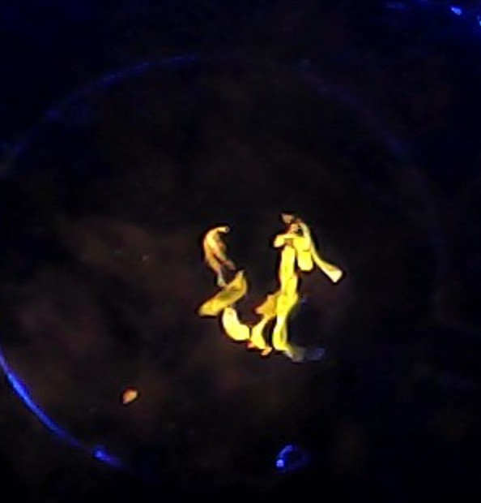
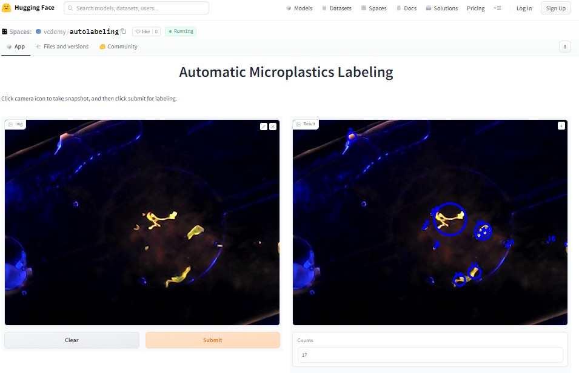

# TICOG2023
Taiwan International Conference on Ocean Governance

## Developing a Low-Cost Microplastic Screening Station using Homemade Microfluidic Devices and Computer Vision for STEM Education in Secondary Schools

**Authors**  
Syuan Chen Wong¹, Daniel Gau², Yuki Shibata³, Jadon Alexander Tang⁴, Tiffany Gau⁵, Shan Yin Tsai*  
¹ Grade 8 Student, Morrison Academy Kaohsiung  
² Grade 9 Student, Kaohsiung American School  
³ Grade 8 Student, Morrison Academy Kaohsiung  
⁴ Grade 8 Student, Morrison Academy Kaohsiung  
⁵ Grade 7 Student, Kaohsiung American School  
*Associate Director, Pathology Department, An Nan Hospital, China Medical University, Tainan, Taiwan.  

---

## Abstract

Taiwan is a maritime nation that has relied on marine resources for its development throughout its history. To achieve sustainable development in this
country, marine science education is increasingly important. However, the integration of STEM education into this topic is rarely applied in secondary schools due to a lack
of availability of laboratory-level equipment. Microplastic pollution is a pressing environmental issue, and detecting microplastics in the marine environment is
essential for developing effective strategies to mitigate this problem. However, existing detection tools are limited in terms of accessibility and convenience, while
high equipment costs also restrict research in secondary school-level academia.

To address these challenges, we modified kitchen-based equipment to create a low-cost and user-friendly microplastic screening station using homemade
microfluidic devices and computer imaging algorithms. In our preliminary results, we evaluated the reaction time for microplastic staining and compared it to conventional
staining techniques. Our fabricated device provides an alternative method for detecting microplastics that is more standardized and automatic.

This study has important implications for STEM education, as it provides an accessible direction for undergraduate students in biotechnology research and
extends their research field to an advanced level. By offering a low-cost and user-friendly screening method, our study can also help promote research on microplastic
pollution in a broader range of academic settings.

**Keywords:** computer vision, education, homemade, microplastic, microfluidic, STEM.

---

## Introduction

Microplastic pollution is a global problem that has a significant impact on marine ecosystems, including those in Taiwan. Taiwan is an island nation that is particularly
vulnerable to plastic waste, with an estimated 15,000 tons of plastic waste entering its oceans every year (Greenpeace East Asia, 2022). This pollution threatens the health of marine
organisms, as well as the livelihoods of those who rely on the ocean for food and tourism (Megan,2021).

Microplastics are small plastic particles that accumulate in the environment due to various reasons, such as plastic waste, industrial effluents, and plastic debris in oceans
(Geyer, Jambeck &amp; Law,,2017). These microplastics have become a significant environmental concern as they can have severe impacts on the ecosystem (Vecchi, Bianchi,
Scalici, Massimiliano, Fabroni &amp; Tomassetti, 2021). To address this problem, there is a growing need to educate students in Taiwan about microplastic pollution and its impact on
the marine environment (Lai, 2021). Tsai&#39;s study showed that STEM-based implementation in marine science teaching increases the success rate and attitude of younger students (Tsai,
Chang &amp; Cheng, 2021).

However, traditional methods of detecting microplastics are expensive and require specialized equipment and expertise, making it difficult to incorporate them into marine
science education in lower-secondary schools. The detection of microplastics in the environment is a challenging task and requires specialized techniques and equipment.
Techniques for microplastic detection include visual observation with or without staining maneuvers, ultrasound scanning, Fourier-transform infrared spectroscopy (FTIR), Raman
spectroscopy, and scanning electron microscopy (SEM) (Huang, Hu &amp; Wang, 2023). However, all of this equipment is expensive, time-consuming, and technically challenging,
which makes it difficult to expand screening detection.

One of the recent advancements in this field is the use of microfluidic devices for the detection of microplastics. Microfluidic devices are miniature devices that use channels and
chambers to manipulate small volumes of fluids. These devices typically consist of microchannels, chambers, and valves that are fabricated on a substrate using microfabrication techniques. Microfluidic devices have several advantages over traditional analytical techniques, such as reduced sample volume, improved sensitivity, and faster
analysis time (Novotny &amp; Foret, 2016). These devices are used in various applications, such as chemical analysis (Elvira, i Solvas, Wootton &amp; deMello, 2013), medical
diagnostics , and environmental monitoring (Sachedva, Davis &amp; Saha, 2021). In marine science , the use of microfluidic devices allows for the separation and identification of
microplastics from complex environmental matrices. The detection of microplastics using microfluidic devices involves several steps, such as sample collection, sample preparation,
and analysis.

Microfluidic devices and computer vision technology are relatively new ideas in the field of microplastic detection. While traditional methods of detecting microplastics, such as
microscopy and spectroscopy, require expensive laboratory equipment and trained personnel. Our homemade microfluidic devices, which can be made using
polydimethylsiloxane (PDMS) materials, offer a low-cost alternative to commercial microfluidic devices. Computer vision technology, on the other hand, refers to the use of
algorithms and software to analyze images and videos. In the context of microplastic detection, computer vision technology can be used to analyze images of microplastics that
are captured using a microscope or a camera. This technology offers a fast and accurate way to detect and classify microplastics.

By combining homemade microfluidic devices and computer vision technology, it is possible to detect microplastics in a cost-effective and accessible manner. This has
significant implications for marine science education, as it allows students to learn about microplastic pollution and contribute to the efforts of monitoring and reducing microplastic
pollution in their local communities.

In this paper, we demonstrate how to make a microplastic detection apparatus with limited and relatively low-cost fabrication settings. The accuracy and availability were also tested compared with the conventional bench manner. The tricks of the trade were also discussed for microfluidic chip fabrication.

---

## Methodology

1. Microfluidic chip fabrication

The method of soft lithography is used for creating microfluidic devices. The channel design was created using SolidWorks 2013 x64 bit edition. The staining chip consists of two
functional units: a zigzag mixing channel and a serpentine-shaped reactor channel (Figure 1). The total length of the channel was calculated, and a mold for casting polydimethylsiloxane
(PDMS) was created using a resin 3D printer (Phrozen mini 8K, Aqua 8K gray resin, 0.022um layer height, Chitubox slicing software). PDMS (Dowsil™, Sylgard 184, Density
1.03 g/cm3) was then prepared in a 10:1 ratio and fully degassed in a vacuum chamber. The PDMS was carefully poured into the mold without any bubbles and cured in a modified
toaster oven with a temperature control unit (Figure 2). The mold was placed at 80 degrees Celsius for 60 minutes, and after the PDMS had completed the crosslinking reaction, it was
carefully demolded using a flat-shaped instrument with a special rotational maneuver.

The PDMS layer and slide glass were surface-treated using homemade microwave Argon plasma treatment under pressure down to 0.5 miniTorr (using a Whirlpool microwave
700W). A 3-way air tube system was created with argon air supplementary and vacuum pressure for the modification of the microwave (Figure 3). After plasma treatment, the
PDMS chip was sealed with further baking at 80 degrees Celsius for 10 minutes (Figure 4). 

The inlet and outlet of the microfluidic chip were punch-cut using a 4mm puncher and
connected using a 4mm PTFE tube. A ceramic microheater was used and set up beneath the microfluidic chip . A temperature sensor with an Arduino board controlled the microfluidic
working temperature to around 80 degrees Celsius (Figure 5). A double-channel peristaltic pump was used for the microfluidic devices, and the PTFE tube was connected with flow
speed control from 0.0033 to 10.03ml/min. The concentration and temperature of the staining process were controlled at 50X and 80 degrees Celsius, respectively.

2. Microplastic sample preparation

In this study, the microplastic sample polyethylene (PE) was prepared using a machine grinder. Two milligrams of ground PE was filtered through a sieve to a size of 2mm and
mixed with 2 ml of reverse osmosis (RO) water. Additionally, 0.5 ml of RO water was prepared as a control sample.

3. Nile Red (9-diethylamino-5H-benzo[α]phenoxazine-5-oneStain) Preparation

The staining solution was prepared by dissolving Nile Red (99%, thermo scientific,CAS no:7385673 ) in methanol( 99.5%, Miani Chem, Cas No.67-56-1 ) (1 mg/ml) with dilution of
50X .

4. Conventional staining procedure

For conventional bench staining procedure, 0.25ml Nile Red staining solution was mixed with 0.25ml of microplastic sample solution inside the Eppendorf tube. The tube
was placed in the temperature control toast oven with 80 Celsius degrees. The time for reaction was tested: 5,15 and 20 minutes.

5. Microfluidic reactor staining experiment

For the microfluidic device staining procedure, Nile Red prepared solution was connected to Inlet A, and the microplastic sample solution was connected to Inlet B. The total
microchannel length was 6 mm, and the cross-sectional area was 3 x 3 mm. To compare with the conventional bench experiment, the corresponding flow rate of 0.05, 0.0333and 0.025
mL/min were set for 5, 15 and 20 minutes, respectively. The mixture was then directed to the outlet C and flowed into the observation reservoir.

6. Computer vision and auto counting setting.

After the staining reaction, the sample was infused into the observation reservoir, and immediate analysis was conducted. Image acquisition and analysis were performed using a
460 nm wavelength USB blue light (EHE, model U12H1-B, 460 nm, 120 degrees, made in Taiwan), which was illuminated towards the observation reservoir chip. Images were captured
using a generic USB microscope. A Kapton Tape was used for background filtering of microscope imaging, and the fluorescent signals from the samples were observed. The
acquired images, with a resolution of 1920 x 1440 pixels, were processed using a web base online computer vision technique. The Nile-Red-stained particles were marked using
computer vision with Python code. The algorithm extracted the red channel of the image, which corresponded to the fluorescence emission wavelength of Nile Red, and automatically
calculated the number of particles. The number of microplastic particles was counted and recorded in correlation with the residency time in the microfluidic device.

---

## Results

At the time of staining, the microplastic particles counted by computer vision
were recorded in Table 1. The graph is plotted below.

Table 1. The particle count of PE using computer vision in the conventional staining
method and microfluidic system method.

<table border=1>
<tr><td></td><td span=2>Particle Count</td></tr>
<tr><td></td><td>Conventional Bench Staining</td><td>Microfluidic Chip Staining</td></tr>
<tr><td>Control</td><td>0</td><td>0</td></tr>
<tr><td>5 minutes</td><td>6</td><td>4</td></tr>
<tr><td>15 minutes</td><td>14</td><td>12</td></tr>
<tr><td>20 minutes</td><td>13</td><td>16</td></tr>
</table>

Influence of Flow Rate on Nile Red Staining at Fixed Temperature: A Graphical Study

---

## Discussion

Marine science education in Taiwan is gaining importance due to its strategic location as an island nation and its reliance on ocean resources. The government also promotes public awareness of marine conservation and sustainable development through various campaigns and initiatives. For example, in 2021, the Ministry of Education launched the "Marine Education 2030" program, which aims to integrate marine science education into the national curriculum to foster a better understanding of marine ecosystems and conservation among students (Taiwan Ministry of Education, 2020). In recent years, Taiwan has invested heavily in marine research and education, with several universities offering marine science programs and research centers focused on marine issues.

However, marine science education in Taiwan faces several challenges, particularly in secondary school programs. One of the most significant limitations is the lack of adequate equipment, which prevents students from gaining hands-on experience in the field. This equipment shortage hampers the development of practical skills and scientific knowledge that are essential for pursuing marine science careers.
 
Without access to adequate equipment, students may struggle to fully understand the concepts they are taught in the classroom. They may also lack the skills needed to conduct scientific research and experiments, hindering their ability to develop critical thinking skills and learn how to apply theoretical knowledge in real-world situations. As a result, the lack of equipment can undermine the quality and effectiveness of marine science education in Taiwan.

With the advancement of semiconductor and biotechnology, research in science education has recognized the potential of downscaled experiments such as nanoscience and nanotechnology in contributing to the scientific literacy of future generations (Taha, Barzinjy, Hussain & Nurtayeva, 2022). To ensure that students are prepared for the demands of future technological innovation, the inclusion of this technology in both high school and undergraduate curricula was recommended (Stavrou, Michailidi, Sgouros & Dimitriadi, 2015) . 

In this paper, we demonstrate the fabrication of a microplastic detection chip using easily accessible home appliances (Figure 6). One of the recent studies that have demonstrated the application of microfluidic devices for the detection of microplastics is the work of T.S. Farhadi et al. (2021) in the journal of Science of The Total Environment. The study developed a microfluidic device that can extract, isolate and characterize microplastics from environmental samples. Microfluidic devices have shown great potential for the detection of microplastics in environmental samples (Mesauita, Gong & Lin, 2022)..

We compared the performance of a microfluidic system with conventional methods in our experiment. Our results showed that a microfluidic system work with a flow rate of around 0.04 mL/min yielded comparable results to the conventional bench work. However, as the reaction time increased, the microfluidic system demonstrated a clear advantage over the bench work, with better efficiency and reduced static saturation of mixing ability. This may be due to the continuous reaction style and mixing ability of the microfluidic system.

We gained a lot of experience during the fabrication process, including learning how to create design drawings in 3D software, mold making with a 3D printer, producing PDMS molds using a vacuum chamber, generating plasma for surface treatment, and setting up the microfluidic apparatus. The most fascinating experiment we conducted was the plasma generation for PDMS bonding. A commercial plasma generator can cost anywhere from 70,000NTD to 300,000NTD, which is not affordable for a secondary school project. However, through research on YouTube and Tech Web, we built a DIY microwave plasma treater. This device uses high-frequency electromagnetic waves to create a plasma inside a chamber, which can be used to modify the surface properties of various materials. The plasma can increase the surface energy of materials, create functional groups on the surface, and improve their adhesion properties. It is a useful tool for researchers who want to modify the surface properties of materials for various applications.

We used Argon gas for the plasma generation instead of the commonly used oxygen plasma in most literature on microfluidic chip making. Our initial consideration for using Argon gas was safety and availability, as oxygen gas is flammable, while Argon gas is relatively inert. Additionally, we had a welding machine that used Argon gas. Moreover, we found that Argon plasma is a better choice for surface modification and treatment applications due to its lower reactivity, stability, and versatility. Oxygen plasma can cause oxidation and other damage to certain materials, which makes it less suitable for some applications (Nascimento, Moshkalev, Machida & Parada, 2015). Overall, using Argon plasma proved to be a safer and more efficient option for our research project (Figure 7).

During the fabrication process of the PDMS chip, we encountered many pitfalls and difficulties compared to using commercialized equipment. For example, we were unable to achieve low air pressure due to an unsealed chamber, which is a common microwave container. In addition, the extremely high temperature of the high-energy plasma generated caused damage to the container and even led to glass explosions. Plasma can cause thermal stroke on glass, which can lead to cracking or breaking. To prevent this from happening, tempered glass is necessary, as it is designed to withstand thermal shock. However, an experimental level pyrex vacuum chamber, which can prevent glass explosions, costs around 18,000 NTD, making it unaffordable for us. To find a suitable container for plasma treatment, we tried and broke many different brands of containers, and most of the time, we were unable to establish low pressure due to the high vacuum force causing the cover to deform. The major problem was the meltdown of the plastic upper lid, as we could not control the plasma contact with the upper lid wall (Figure 8). After much trial and error, we finally found a specific brand and series of microwave containers that met our criteria and only cost 400 NTD. This container had a pyrex upper lid glass and a ventilation opening that matched the air tube. We were able to successfully use this type of container for plasma treatment without any more glass damage (Figure 9).

Another problem we encountered was the fragility of the PDMS during demolding. When we pulled the PDMS layer out of the 3D printed mold, it would crack. To solve this problem, we used flat steel tweezers with a mild curve. Instead of directly pulling up the layer, we circled the peripheral edge of the round mold several times (Figure 10). This helped to gradually elevate the PDMS layer without damaging it.

Since we used hand-ground plastic debris as our sample, we were unable to obtain the regular bean-shaped samples found in commercial microplastic samples (Figure 11). Additionally, some of the plastic debris in our sample was as large as 4mm, making it difficult to downsize the sample to 2mm. This created two issues during our experiments. Firstly, most previous literature mentioned using a small caliber tube with a 2mm diameter. However, the irregular plastic debris got stuck in the tube during the experiment, which necessitates redesigning the channel with a bigger cross-section and using a larger caliber silicone tube for connection. Secondly, the computer vision we used was programmed to identify continuity ( Figure 12), but the irregular plastic shape confused the particle count, necessitating manual correction by a human. 

In this study, we developed a "millifluidic" device as our sample was in the millimeter scale, which is more practical for secondary school level education. In education, particularly for micro to nanotechnology, easy-to-make microfluidic chips are essential tools for generating interest among school students.

Our cheap microfluidic devices are particularly valuable because this made the technology more accessible to researchers and education providers in low-resource settings. By using low-cost materials and simple manufacturing techniques, these devices can be produced quickly and easily, making them an ideal tool for STEM education and research.

## Figures

Figure 1. The step of soft lithography for making microfluidic PDMS layer

Figure 2. The curing process of PDMS in the temperature control toast over.

Figure 3. Modification of kitchen microwave. The case was removed and the 3 way air valve setting PTFE tube was drilled into the microwave chamber. The vacuum tube was insert to the air opening of the pyrex glass container

Figure 4. The PDMS chip complete after PDMS-glass bonding reaction

Figure 5. The setting of microfluidic chip microscope and heater. a: The microscope with 460 nm light source. b: The microfluidic tube connection. c: Ceramic microheater. d: An old delta-type 3d printer was disassembled. The arduino board and heating unit was reused.

Figure 6. The equipment for microfluidic chip fabrication.

Figure 7. The plasma generation.  (a) The light blue color of the plasma indicates the ionization of the oxygen residue in the vacuuming container. (b) The deep purple color of the plasma indicated the ionization of argon gas. 

Figure 8. Pitfalls of the PDMS chip fabrication. Left: The thermal shock caused by sudden temperature changes during plasma treatment can lead to breakage. Even a non-pyrex vacuum chamber with a 1 cm thick glass wall cannot withstand this thermal shock, which can result in cracking. Right: The cover lip can melt, preventing the achievement of low-pressure conditions. Even if we apply heat-resistant silicone (5842A, FinesilⓇ, Taiwan) to the plastic cover, it can still deform and cause air leakage.

Figure 9. The final choice of microwave container consists of a body and cover made of Pyrex glass, which is capable of withstanding temperatures of up to 600C. The container also features an original air hole with silicone sealant, which provides perfect access for the vacuum and argon gas tubes.

Figure 10. Flat steel tweezers with a mild curve can be used to smoothly lift the entire PDMS layer without tearing 

Figure 11. The capture image of irregular shaped microplastic debris. 

Figure 12.  Online automatic labeling program. 

---

## Conclusion

This study developed a user-friendly microplastic screening station using home-made microfluidic devices and computer imaging algorithms. This approach offers an affordable alternative for detecting microplastics, which can be a significant barrier for many researchers and institutions due to the high cost of microfluidic devices. Integrating this topic into secondary school education can raise awareness of the need for research on microplastic detection and promote scientific innovation for environmental monitoring and management. Additionally, the study fosters critical thinking and problem-solving skills, inspiring innovative solutions for environmental problems and promoting sustainable development. This approach provides a valuable direction for undergraduate students in biotechnology to learn about advancements in technology and their application in environmental science.

---

## References

- Elvira, K. S., i Solvas, X. C., Wootton, R. C. R., & deMello, A. J. (2013). *The past, present and potential for microfluidic reactor technology in chemical synthesis.* Nature Chemistry, 5(11), 905–915.  
- Farhadi, T.S. et al. (2021). *Microplastics in the environment: Occurrence, risks and remediation.* *Science of The Total Environment*, 758, 143555.  
- Geyer, R., Jambeck, J. R., & Law, K. L. (2017). *Production, use, and fate of all plastics ever made.* *Science Advances*, 3(7).  
- Greenpeace (2022). *Annual Report 2021.*  
- Huang, Z., Hu, B., & Wang, H. (2023). *Analytical methods for microplastics in the environment: a review.* *Environmental Chemistry Letters*, 21, 383–401.  
- Lai, C.S. (2021). *A study of the learning outcomes on marine education.* *International Journal on Social and Education Sciences*, 3(3), 589-602.  
- Mesquita, P., Gong, L., & Lin, Y. (2022). *A Low-Cost Microfluidic Method for Microplastics Identification.* *Micromachines*, 13(4), 499.  
- Nascimento, F.D. et al. (2015). *Treatment of PDMS surfaces using pulsed DBD plasmas.* *arXiv*, 1504.03633.  
- Tsai, L.T., Chang, C.C., & Cheng, H.T. (2021). *Effect of a STEM-oriented course on students’ marine science motivation.* *Journal of Baltic Science Education*, 20(1), 134–145.  
- Taiwan Ministry of Education (2020). *Promotion of Marine Education Implementation Project.*  
- Taha, B.T. et al. (2022). *Nanotechnology and Computer Science: Trends and advances.* *Memories*, 2:100011.  
- Vecchi, S. et al. (2021). *Field evidence for microplastic interactions in marine benthic invertebrates.* *Scientific Reports*, 11:20900.  
