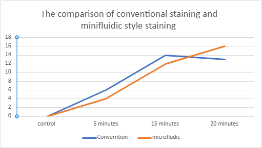
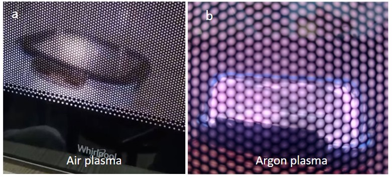
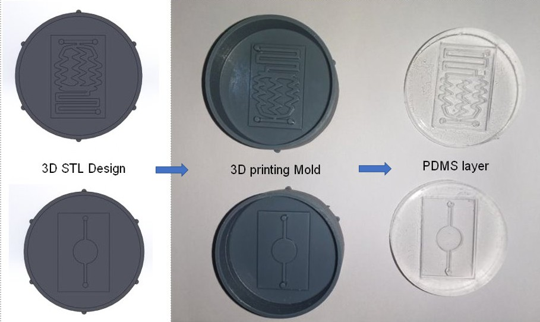
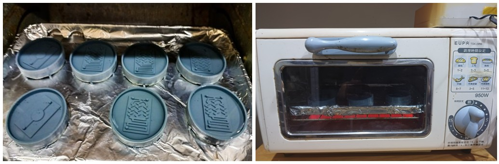

# TICOG2023
Taiwan International Conference on Ocean Governance

# Developing a Low-Cost Microplastic Screening Station using Homemade Microfluidic Devices and Computer Vision for STEM Education in Secondary Schools

**Authors**  
Syuan Chen Wong¹, Daniel Gau², Yuki Shibata³, Jadon Alexander Tang⁴, Tiffany Gau⁵, Shan Yin Tsai*  
¹ Grade 8 Student, Morrison Academy Kaohsiung  
² Grade 9 Student, Kaohsiung American School  
³ Grade 8 Student, Morrison Academy Kaohsiung  
⁴ Grade 8 Student, Morrison Academy Kaohsiung  
⁵ Grade 7 Student, Kaohsiung American School  
*Associate Director, Pathology Department, An Nan Hospital, China Medical University, Tainan, Taiwan.  

---

## Abstract

Taiwan is a maritime nation that has relied on marine resources for its development throughout its history. To achieve sustainable development, marine science education is increasingly important. However, the integration of STEM education into this topic is rarely applied in secondary schools due to a lack of laboratory-level equipment.  

To address this challenge, we modified kitchen-based equipment to create a **low-cost, user-friendly microplastic screening station** using homemade microfluidic devices and computer imaging algorithms. Our preliminary results show that this device can effectively detect microplastics in a standardized and automatic way.

**Keywords:** computer vision, education, homemade, microplastic, microfluidic, STEM.

---

## Introduction

Microplastic pollution is a global environmental problem. Taiwan, being an island nation, faces an estimated **15,000 tons of plastic waste entering the ocean annually** (Greenpeace East Asia, 2022).  

Traditional microplastic detection tools (FTIR, Raman, SEM) are expensive and not feasible for school labs. Microfluidic devices and **computer vision algorithms** offer affordable and accessible alternatives for microplastic detection, allowing students to engage in hands-on environmental science and technology learning.

---

## Methodology

### Microfluidic Chip Fabrication
Soft lithography was used to create PDMS-based microfluidic chips with zigzag and serpentine channels. Molds were designed in SolidWorks and 3D printed. PDMS was poured, degassed, and cured in a **modified toaster oven**. Surface bonding was achieved with **homemade microwave Argon plasma**.

### Microplastic Sample Preparation
Ground polyethylene (PE) was sieved to <2mm and suspended in reverse osmosis (RO) water. Control samples used RO water only.

### Nile Red Staining
Nile Red (1 mg/mL in methanol) was diluted 50× for fluorescence staining.

### Conventional Staining
Microplastic and dye solutions were mixed and heated at 80°C for 5, 15, and 20 minutes.

### Microfluidic Reactor Staining
Nile Red and sample solutions flowed through the microfluidic chip at 0.05–0.025 mL/min, allowing on-chip staining and mixing.

### Computer Vision Analysis
Fluorescent images were captured under a 460 nm blue light microscope and analyzed using a **Python-based computer vision algorithm** that counted Nile-Red-stained particles automatically.

---

## Results

| Staining Method | Time | Particle Count |
|-----------------|------|----------------|
| Control | — | 0 |
| Conventional | 5 min | 6 |
| Conventional | 15 min | 14 |
| Conventional | 20 min | 13 |
| Microfluidic | 5 min | 4 |
| Microfluidic | 15 min | 12 |
| Microfluidic | 20 min | 16 |

**Observation:**  
The microfluidic method achieved comparable or superior staining efficiency, especially for longer reaction times due to improved flow mixing.

---

## Discussion

Marine science education in Taiwan is constrained by the lack of lab equipment. Our project demonstrates that **household tools can replace professional instruments** for meaningful STEM learning.  

Key takeaways:
- Argon plasma bonding provided a safer, cost-effective alternative to commercial plasma systems.  
- DIY adaptations reduced cost from >NT$70,000 to <NT$400 while maintaining functionality.  
- Challenges such as PDMS fragility and irregular microplastic shapes were overcome through iterative design and programming fixes.

This approach provides a **millifluidic system** practical for secondary school settings—bridging environmental science, engineering, and computer vision.

---

## Conclusion

This study developed a **low-cost, user-friendly microplastic screening station** integrating homemade microfluidic devices and computer vision.  

It:
- Makes advanced microplastic research accessible to students and educators.  
- Promotes STEM engagement and environmental awareness.  
- Encourages innovation in resource-limited educational environments.

The project demonstrates how **DIY microfluidics and AI-based imaging** can inspire sustainable science education.

---

## References

- Elvira, K. S., i Solvas, X. C., Wootton, R. C. R., & deMello, A. J. (2013). *The past, present and potential for microfluidic reactor technology in chemical synthesis.* Nature Chemistry, 5(11), 905–915.  
- Farhadi, T.S. et al. (2021). *Microplastics in the environment: Occurrence, risks and remediation.* *Science of The Total Environment*, 758, 143555.  
- Geyer, R., Jambeck, J. R., & Law, K. L. (2017). *Production, use, and fate of all plastics ever made.* *Science Advances*, 3(7).  
- Greenpeace (2022). *Annual Report 2021.*  
- Huang, Z., Hu, B., & Wang, H. (2023). *Analytical methods for microplastics in the environment: a review.* *Environmental Chemistry Letters*, 21, 383–401.  
- Lai, C.S. (2021). *A study of the learning outcomes on marine education.* *International Journal on Social and Education Sciences*, 3(3), 589-602.  
- Mesquita, P., Gong, L., & Lin, Y. (2022). *A Low-Cost Microfluidic Method for Microplastics Identification.* *Micromachines*, 13(4), 499.  
- Nascimento, F.D. et al. (2015). *Treatment of PDMS surfaces using pulsed DBD plasmas.* *arXiv*, 1504.03633.  
- Tsai, L.T., Chang, C.C., & Cheng, H.T. (2021). *Effect of a STEM-oriented course on students’ marine science motivation.* *Journal of Baltic Science Education*, 20(1), 134–145.  
- Taiwan Ministry of Education (2020). *Promotion of Marine Education Implementation Project.*  
- Taha, B.T. et al. (2022). *Nanotechnology and Computer Science: Trends and advances.* *Memories*, 2:100011.  
- Vecchi, S. et al. (2021). *Field evidence for microplastic interactions in marine benthic invertebrates.* *Scientific Reports*, 11:20900.  
